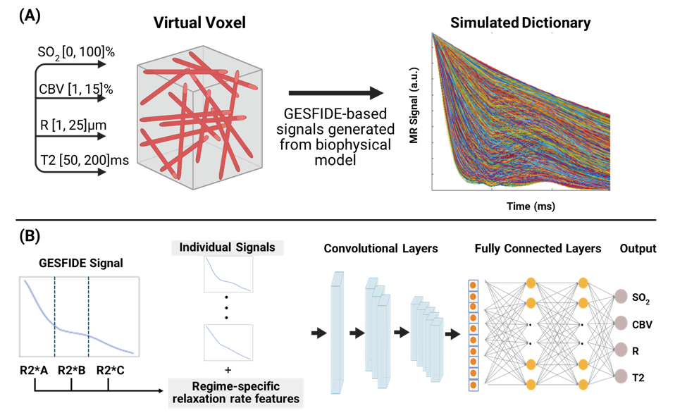

# MRvF: deep-learning vascular fingerprinting from GESFIDE MRI

**Goal:** measure the brain's microvasculature (blood oxygenation, blood volume, vessel size) from an ordinary MRI scan,
quickly and accurately, by teaching a neural network to read the MRI signal.

<p align="center">
  
</p>

**How to read the figure**

- **(A) Simulate.** A computer model of a small block of brain tissue, filled with randomly oriented blood vessels, is run over
  many combinations of the four parameters below. Each combination produces the MRI signal it would give. Together these
  1.5 million simulated signals form a **dictionary** with known ground truth.
- **(B) Learn.** Each signal is split into three time segments and summarised by three relaxation rates (R2\*<sub>A</sub>, R2\*<sub>B</sub>, R2\*<sub>C</sub>).
  A convolutional network takes the signal plus these features and predicts the four parameters directly.

| Parameter | Meaning | Unit |
|---|---|---|
| **SO₂** | blood oxygen saturation | % |
| **CBV** | cerebral blood volume fraction | % |
| **R** | mean vessel radius | µm |
| **T2** | tissue transverse relaxation time | ms |

The classic approach, **dictionary matching (DM)**, looks each measured signal up in the dictionary. It is slow and degrades in
noise. This project replaces the lookup with a small network and measures how much more accurate it is across noise levels
(notebook 02 reproduces that comparison).

## Quick start

You need Python ≥ 3.11 and, for reasonable speed, an NVIDIA GPU.

```bash
pip install -e .                 # installs the `mrvf` library and its dependencies
python -m unittest discover -s tests     # 16 fast tests, no data needed

# reproduce the published RMSE-vs-SNR numbers from the shipped models (needs the simulation data, ~5 min on a GPU)
python scripts/run_pipeline.py evaluate --stats --compare-to results/ablation_results/ablation_rmse.json
# expected last line: "... 64 values, max |diff| = 0"

# retrain both networks and evaluate them (long: see "How long does it take"; add --epochs 3 for a quick trial)
python scripts/run_pipeline.py all
```

**Data.** The simulation dictionaries are large and are not in this repository. By default the code looks for them one level
above the repository:

```
<parent folder>/
├── subsamples/subsamples_v3/     QuasiRand_par_t2_200.mat       ground-truth parameters   (key: par_save)
│                                 QuasiRand_t2_200.mat           noise-free signals        (key: Dico40_save)
│                                 QuasiRand_t2_snr{20,50,100,150}.mat   noisy signals      (key: Dico40_save)
├── echotimes.mat                 the 40 echo times, in ms
└── MRvF_Manuscript-clean/        ← this repository
```

Elsewhere? Pass `--data-dir` and `--echotimes`, or edit `configs/default.toml`.

## What is in the repository

```
src/mrvf/            the library: all reusable logic (see below)
scripts/
  run_pipeline.py    command-line entry point: train | evaluate | all
notebooks/
  01_train_triple_regime.ipynb      thin notebook: train both networks
  02_evaluate_rmse_vs_snr.ipynb     thin notebook: evaluate DM + networks, check against published numbers
  legacy/                           earlier analysis notebooks, not yet ported to the library (see below)
configs/default.toml   every setting (ranges, echo geometry, hyper-parameters, data paths)
tests/               unit tests
results/             the reference outputs of the published analysis: models, metrics, figures
runs/                (created when you run the pipeline; git-ignored) your own outputs
```

### The library, module by module

| Module | What it does |
|---|---|
| `config` | Typed settings; `load_config()` reads `configs/default.toml`. |
| `io` | Reads dictionaries and echo times from `.mat` files (v5 and v7.3). |
| `preprocessing` | L2 normalisation, scaling parameters to [0, 1], dropping out-of-range / non-finite rows. |
| `features` | The **R2\* features** (below). |
| `models` | `TripleRegimeModel` (the main network) and `Conv1DModel` (the DL-4p baseline). |
| `data` | Builds training / validation / test sets from the dictionaries. |
| `training` | Weighted-MAE loss and the training loop (AdamW, LR-on-plateau, early stopping). |
| `dictionary_matching` | The DM baseline (max inner product against the noise-free dictionary, on GPU). |
| `evaluation` | Inference, RMSE, RMSE vs SNR on a shared test set, feature ablation, paired tests. |
| `plotting` | Figures. |
| `pipeline` | `run_training()` and `run_evaluation()`: what the CLI and both notebooks call. |

Every function takes its inputs as explicit arguments; nothing reads notebook-level globals.

## How the method works

**Input.** A voxel's GESFIDE signal has 40 echoes, in three segments. Each segment decays at its own rate, and those rates
carry vascular information:

| Segment | Echoes | R2\* it measures |
|---|---|---|
| A: free induction decay | 0–13 | R2 + R2′ |
| B: rephasing | 14–29 | R2 − R2′ (can be negative) |
| C: after the spin echo | 30–39 | R2 + R2′ (fitted relative to the spin echo) |

R2\* is the negative slope of a straight-line fit to log-signal against time. The network input has **43 values**:
the 40 L2-normalised echoes followed by the three R2\* values scaled to [0, 1].

**Network.** A 1-D convolutional network reads the 40 echoes; the three R2\* values steer it through FiLM layers
(feature-wise linear modulation). Output: the four parameters, scaled to [0, 1] and rescaled to physical units.

**Compared methods**

| Name | Input | Training data |
|---|---|---|
| **DM** | 40 L2-normalised echoes | none: matched to the noise-free dictionary |
| **DL-4p** | 40 L2-normalised echoes | mixed-SNR; checkpoint shipped in `results/t2snr_results_v4` |
| **Triple-Noisy** | 43-value input | signals pooled from SNR 20, 50, 100, 150 |
| **Triple-NF** | 43-value input | noise-free dictionary only |

All methods are scored on the **same held-out 15 %** of the dictionary at each SNR level (a seeded split), so the comparison is like for like.

## Using the library directly

```python
from mrvf.config import load_config
from mrvf.pipeline import run_training, run_evaluation

cfg = load_config("configs/default.toml")

run_training(cfg, "noisy", "runs/my_model")            # trains, writes models/metrics/figures
run_evaluation(cfg, {"Triple-Noisy": "runs/my_model/models/triple_regime_best.pt"}, "runs/my_eval")
```

Lower-level pieces compose the same way, for example
`features.build_triple_input(signal, timing, geometry, params, scaling)` turns raw signals into network inputs.

## How long does it take (RTX 3060 laptop GPU, 6 GB)

| Step | Time |
|---|---|
| `evaluate` (4 methods, 4 SNR levels, 225k test rows each) | ~2 min |
| training one model, one epoch | ~40 s (1.1 M training rows) |
| `train --variant both` at the default 200 epochs | at most ~2 h per model (200 × ~40 s); less if early stopping triggers |
| `train --epochs 3 --n-samples 200000 --snr-levels 20 150` | a few minutes (smoke test) |

## Reproducibility

- **Evaluation is exactly reproducible.** Running `evaluate` on the shipped checkpoints reproduces the saved
  `results/ablation_results/ablation_rmse.json` with maximum difference 0.
- **Retraining is repeatable but will not reproduce the shipped weights.** The original notebooks did not seed the
  dataset subsampling, network initialisation or batch order. The library seeds all three (default 42; change it with
  `--seed` or `torch_seed` / `subsample_seed` in the config), so repeated runs agree. A retrain gives similar, not identical,
  numbers to the shipped models.
- GPU kernels are not bit-deterministic, so two GPU runs with the same seed differ slightly. On CPU, training is bit-identical to the original code.
- Details of how the refactor was checked against the original notebooks: [`docs/verification.md`](docs/verification.md).

## `results/`: reference outputs of the published analysis

| Folder | Contents | Produced by |
|---|---|---|
| `triple_regime_results_v1/` | Triple-Noisy model, metrics, figures | notebook 01 (formerly `final_TripleRegime_ABC_Train`) |
| `triple_regime_nf_results_v1/` | Triple-NF model, metrics, figures | notebook 01 (formerly `final_TripleRegime_NoiseFree_Train`) |
| `t2snr_results_v4/models/` | DL-4p checkpoint | `notebooks/legacy/01b_Train_and_Evaluate_T2_SNR_v4` |
| `dual_regime_results_v1/` | dual-regime (A+B) checkpoint and metrics, used for an ablation comparison | `notebooks/legacy/DualRegime_T2_Train` |
| `ablation_results/` | RMSE vs SNR for the four methods | notebook 02 (formerly `final_ablation_rmse_vs_snr`) |
| `statistical_comparison/`, `stats_figure/` | RMSE statistics figures | `notebooks/legacy/final_Statistical_RMSE_Comparison*`, `final_Fig_RMSE_SNR_Stats` |
| `snr50_scatter_eval/`, `bland_altman_snr50/` | scatter and Bland–Altman plots at SNR 50 | `notebooks/legacy/final_figure_SNR50_...`, `final_BlandAltman_SNR50` |
| `invivo_smooth_v1/`, `parcellation/`, `figures/` | in vivo group statistics and example-subject figures | `notebooks/legacy/final_*` in vivo notebooks |

## Legacy notebooks (`notebooks/legacy/`)

These are the original, self-contained analysis notebooks. They still work (paths were updated to the `results/`
layout, and each starts by moving to the repository root) but they have not been rewritten to use `src/mrvf`. They cover:

- **DL-4p and dual-regime training** (`01b_…`, `DualRegime_T2_Train`)
- **More simulation figures and statistics** (`final_Fig_RMSE_SNR_Stats`, `final_Statistical_RMSE_Comparison*`, `final_figure_SNR50_…`, `final_BlandAltman_SNR50`, `final_SNR_Visualization_Supplementary`, `visualize_dictionary_signals`)
- **In vivo analysis** (`02c_…`, `final_InVivo_SmoothFirst_v1`, `final_GasChallenge_Statistics`, `final_PerSubject_VoxelDistributions`, `final_E11_Parcellation`, `final_plot_t1w_slices_e11`), which need human-subject data that is **not** included.
- `superseded/`: the three notebooks that notebooks 01 and 02 replace. Kept because they generated some of the figures in `results/`.

## Not included

- **Human-subject data**: per-subject NIfTI volumes, parameter maps and ROI tables. Only group-level statistics and example-subject figures are kept.
- **The simulation dictionaries** (several GB) and the MRVox code that generates them.
- Large regenerable arrays (`.npz` predictions) and superseded model versions.
